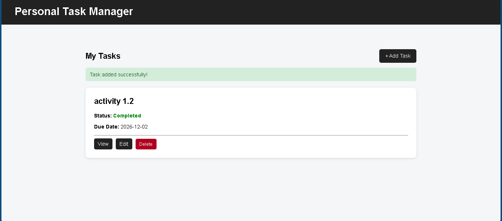

# PersonalTaskManager


## Project Information

**Project Code:** WST21-PM-2026-SF

**Student Name:** Tron Ase M. Camandona

**Course & Year:** BSIT 2 SEC 7

**Database Used:** SQLite

## Features

- Add Task
- View Tasks
- Edit Task
- Delete Task
- Update Status
  - Pending
  - Completed


## Technologies Used

- Laravel
- PHP
- SQLite
- Blade
- HTML
- CSS


## Screenshots

### Dashboard

![Dashboard] (image.png)
### Add Task

![Add Task] (image-1.png)

### Edit Task

![Edit Task] (image-2.png)

### Completed Task

![Completed Task] 
### 1. Clone the repository

```bash
